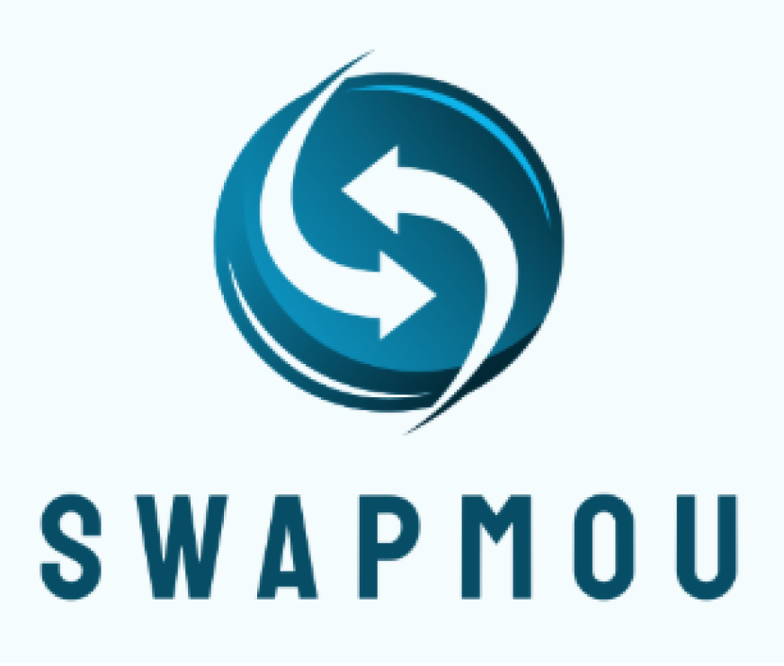

<h1 style="border-bottom: 2px solid #333; padding-bottom: 10px;">Venture Projects</h1>
Prototypes/Startup ideas that I've worked on. For each idea, I've included a brief description, coding language used, apps/software used and links to view the prototype.

## 1) SwapMou: Peer-to-peer Skill Exchange Platform

  

**Description:** SwapMou helps university students who hesitate to learn new skills due to financial constraints by offering a peer-to-peer skill exchange platform, making education more accessible and affordable at scale.
- **Coding Language used:** HTML, CSS, JavaScript, Python
- **Apps/Software used:** PythonAnywhere, Visual Studio Code, Render
- **[View Prototype](https://share21.pythonanywhere.com/login)**

<h1 style="border-bottom: 2px solid #333; padding-bottom: 10px;">Personal Projects</h1>
Personal projects that I've worked on. For each project, I've included a brief description, coding language used, apps/software used and links to view more details or the source code (if applicable).

## 1) Notion: Financial Portfolio Tracker

  <iframe 
    width="560" 
    height="315" 
    src="https://www.youtube.com/embed/Nj9U6B_p2cE?rel=0&modestbranding=1" 
    title="YouTube video player" 
    frameborder="0" 
    allow="accelerometer; autoplay; clipboard-write; encrypted-media; gyroscope; picture-in-picture" 
    allowfullscreen>
  </iframe>

**Description:** A Notion Financial Portfolio Tracker to track my personal investment. Constitutes API calls/queries and embed links to track real-time assets performance. Currently, based only on crypto assets but scalable to other assets as well, potentially a wholistic portfolio in one screen.
- **Coding Language used:** JavaScript
- **Apps/Software used:** Visual Studio Code, Notion, Rows & Excel
<!-- - **[View Project](/documents/23205123_GP_MOBO.pdf)** -->
- **[Source Code](https://github.com/Bryan-Brkat/Notion-Financial-Portfolio-Tracker)**

## 2) PowerBI: Persistency Analysis Data Visualization

  <iframe 
    width="560" 
    height="315" 
    src="https://www.youtube.com/embed/a38C6u1MwYI?rel=0&modestbranding=1" 
    title="YouTube video player" 
    frameborder="0" 
    allow="accelerometer; autoplay; clipboard-write; encrypted-media; gyroscope; picture-in-picture" 
    allowfullscreen>
  </iframe>

**Description:** A PowerBI to identify trends, evaluate product-specific performance, evaluate payment frequency impact, and prepare suggestions to improve company's persistency rate/ decrease churning rate.
- **Coding Language used:** VBA Excel 
- **Apps/Software used:** PowerBI & Excel 

## 3) Google AI Studio: Knowledge Graph & Excel - Coming Soon 

**Description:** An app built with Google AI Studio to enhance CRM tools through improved visuals and interactivity.
- **Coding Language used:** TypeScript & HTML
- **Apps/Software used:** Google AI Studio & Excel

## 4) Personal App: Stock Fundamental Analysis - Coming Soon 

**Description:** An app built with Visual Studio Code to conduct personal fundamental analysis on stocks.
- **Coding Language used:** HTML, CSS, JavaScript & Python
- **Apps/Software used:** Visual Studio Code & Excel

<h1 style="border-bottom: 2px solid #333; padding-bottom: 10px;">University Projects</h1>
## 1) RStudio: Regression Analysis on Coronary Heart Disease

  <iframe 
    width="560" 
    height="315" 
    src="https://www.youtube.com/embed/re_8StVKqsc?rel=0&modestbranding=1" 
    title="YouTube video player" 
    frameborder="0" 
    allow="accelerometer; autoplay; clipboard-write; encrypted-media; gyroscope; picture-in-picture" 
    allowfullscreen>
  </iframe>

**Description:** This was a Regression Analysis assignment done during my final semester in university. The purpose was to identify the best summary statistics via GLM method to predict the chances that a random individual has coronary heart disease.
- **Coding Language used:** R
- **Apps/Software used:** RStudio
- **[View Project]({{ '/documents/Regression_Analysis_Coronary_Heart_Disease.pdf' | relative_url }})**
<!--- **[View Project 2](/documents/ABO-ML-MCMC.pdf)** -->
- **[Source Code]({{ '/documents/Regression_Analysis_Coronary_Heart_Disease_Code.pdf' | relative_url }})**

<!-- ## Using Structural Bioinformatics Approach for GULO functionality

**Description:** Vitamin C is an important cofactor in many important physiological processes. Vitamin C deficiency usually leads to diseases such as scurvy.The GULO gene encodes an enzyme which converts L-gulono-1,4-lactone to L-ascorbate (vitamin C). GULO enzyme (L-gulonolactone oxidase) is required in the terminal step of catalytic reaction. Members of this enzyme fam- ily contain two important domains: FAD-binding domain and ALO domain. Here demonstrates a structural bioinformatics and functional genomics approach to determine the functionality of GULO gene in certain species.
- **Bioinformatics Software & Databases Utilized:** PYMOL, CONSURF, UniProt, ProteinDataBank(PDB), GenBank, NCBI Blastn, Blastp, tBlastn
- **Skills attained:** Statistical Analysis, Hypothesis Testing, Biochemistry, Gene Ontology
- **[View Project](/documents/GULO_Bioinformatics.pdf)**

# Biochemistry-focused Projects
## Investigating molecular mechanism behind DNMT1 methylation of CpG islands

**Description:** I investigated the molecular mechanism of mouse DNMT1-DNA structures with available PDB structures DNMT1 bound to hemi-methylated DNA (4DA4) and unmethylated DNA (3PT6) found on UniProt and ProteinDataBank. 
- **Bioinformatics Software & Databases Utilized:** PYMOL, ClinVar, UK BioBank. CONSURF, UniProt, ProteinDataBank(PDB)
- **[View Project](/documents/Structural_Bioinformatics_Project1.pdf)**

## Investigation of molecular mechanism of Minichromosome Maintenance Protein (MCM) protein-DNA interactions 

**Description:** Part of my biochemistry module, we utilized both wet lab and bioinformatics approaches to investigate the molecular mechanism of MCM protein. 
- **Bioinformatics Software & Databases Utilized:** PYMOL, CONSURF, UniProt, ProteinDataBank(PDB)
- **Skills attained:** Biochemistry, SDS-Page Gel Electrophoresis, Electrophoretic Mobility Shift Assay, Bioinformatics
- **[View Project](/documents/MCM_Protein_Project.pdf)** -->

For inquiries or further information about my work, feel free to [email me](mailto:bryanbrkat1312@gmail.com) or check out my [GitHub profile](https://github.com/Bryan-Brkat).
